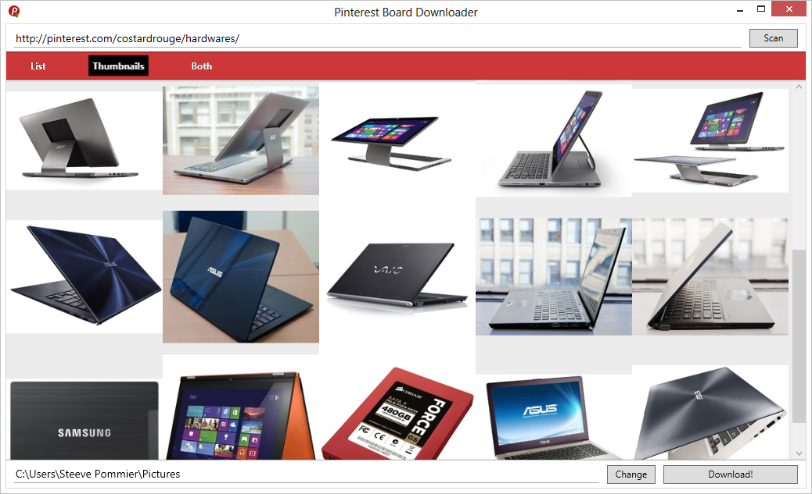

Piny
====
> A tool to download images from Pinterest boards.

### Download

* [Donwload Piny - version 0.4.0](https://github.com/CostardRouge/Piny/releases/download/0.4.0/Piny-v0.4.0.zip "Fourth release")
* [Donwload Piny - version 0.3.0](https://github.com/CostardRouge/Piny/releases/download/0.3.0/Piny-v0.3.0-Windows.zip "Third release")
* [Donwload Piny - version 0.2.0](https://github.com/CostardRouge/Piny/releases/download/0.2.0/Piny-v0.2.0-Windows.zip "Second release")
* [Donwload Piny - version 0.1.0](https://github.com/CostardRouge/Piny/releases/download/0.1.0/Piny-v0.1.0-Windows.zip "First release")

### How to use

1. Enter the board URL
2. Click to scan (images found will be shown as thumbnails)
3. Choose a folder
4. Click on the Download! button
5. Enjoy :)

### Todo

* Support infinite scroll page
* Download from anypage page of the site.
* Options to create a folder with the board name.
* Options to also save the thumbnails ?!
* Handles exceptions

### Release history

All releases are here : https://github.com/CostardRouge/Piny/releases

### Author
> Steeve Pommier

* [Website](http://costardrouge.eu)
* [Twitter](https://twitter.com/LeBlousonRouge)